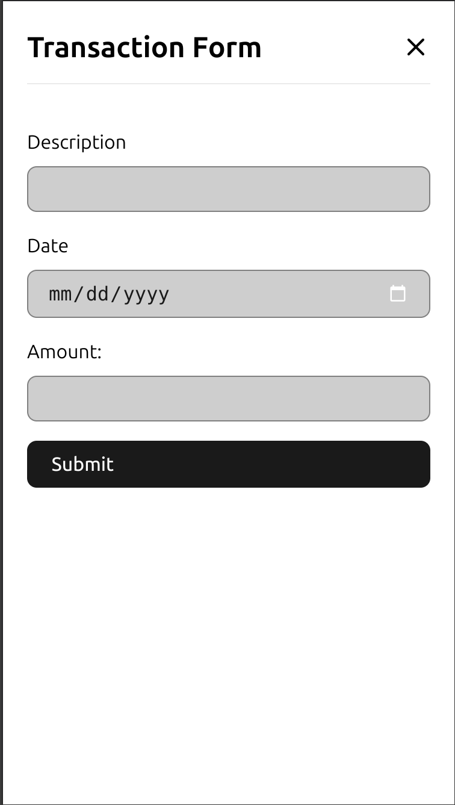
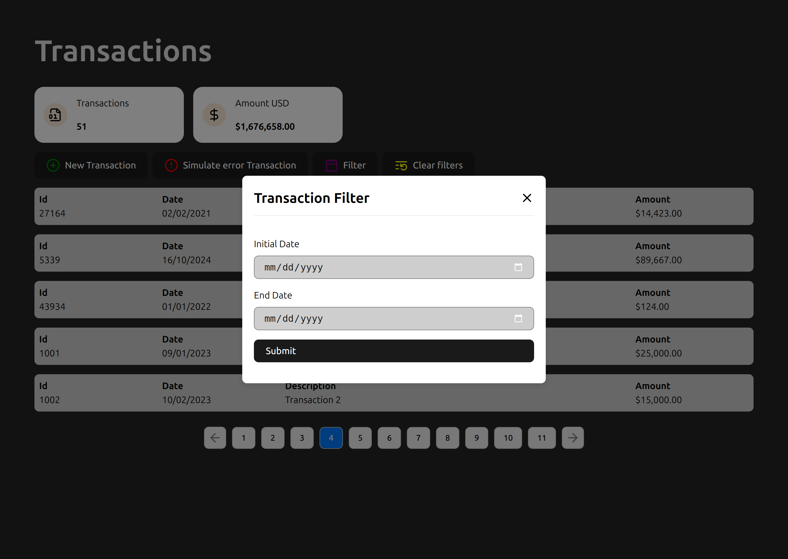

# Transaction Listing Project

This project implements a transaction listing application using React and Vite, with a mock backend powered by the `vite-plugin-simple-json-server`. It allows users to view a list of transactions, create new transactions, and filter by date range. The transaction listing is paginated, limited to 5 per page. A summary of transactions is also provided, displaying the total count and sum of all transactions.

## Features

- Paginated transaction listing.
- Summary with total records and transaction amount.
- Form to create new transactions.
- Filter transactions by date range.
- Styled using `scss modules`.
- Validation with `react-hook-form` and `zod`.
- Notifications using `react-toastify`.

## Technologies Used

- **React**
- **Vite**
- **vite-plugin-simple-json-server** (mock backend)
- **SCSS Modules** (styling)
- **Axios** (HTTP requests)
- **React Hook Form** and **Zod** (form handling and validation)
- **React Toastify** (notifications)
- **Constate** (state management)

## Screenshots

#### transactions-desktop


#### transactions-mobile


#### transactions-form-desktop


#### transactions-form-mobile



#### transactions-filter-desktop



#### transactions-filter-mobile


## Installation

1. Clone the repository:

```bash
git clone https://github.com/vitorrios1001/transactions.git
cd transactions
```

2. Install the dependencies:

```bash
npm install
```

3. Start the project:

```bash
npm run dev
```

The project will be running at: [http://localhost:5173](http://localhost:5173)

## Mock Backend

The backend is mocked using `vite-plugin-simple-json-server` with two main routes:

1. `/api/transactions`: Returns a paginated list of transactions with the following structure:

```json
{
  "id": "1003",
  "description": "Transaction 3",
  "amount": 20000,
  "date": "2023-03-12T00:00:00.000Z"
}
```

2. `/api/transactions-summary`: Returns a summary with the total record count and sum of all amounts.

```json
{
  "amount": 50000,
  "count": 10
}
```

### JSON Server Configuration Example

```js
jsonServer({
  urlPrefixes: ['/api/'],
  handlers: [
    {
      pattern: '/api/transactions-summary',
      handle: (_req, res) => {
        const transactions = JSON.parse(
          fs.readFileSync('mock/transactions.json', 'utf-8')
        );

        const result = (transactions as ITransaction[]).reduce(
          (acc, curr) => ({
            amount: curr.amount + acc.amount,
            count: acc.count + 1,
          }),
          { amount: 0, count: 0 }
        );

        res.setHeader('content-type', 'application/json');
        res.end(JSON.stringify(result));
      },
    },
  ],
});
```
